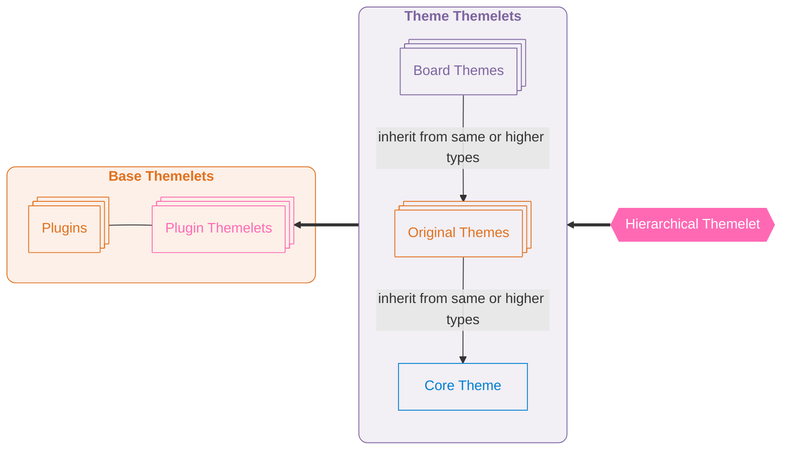
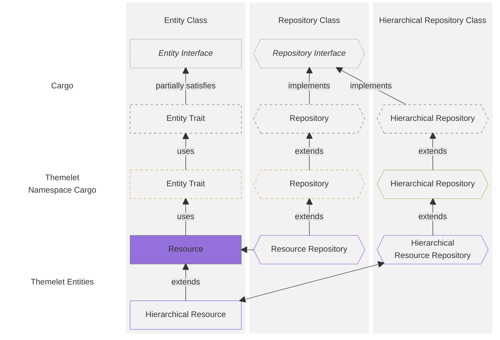
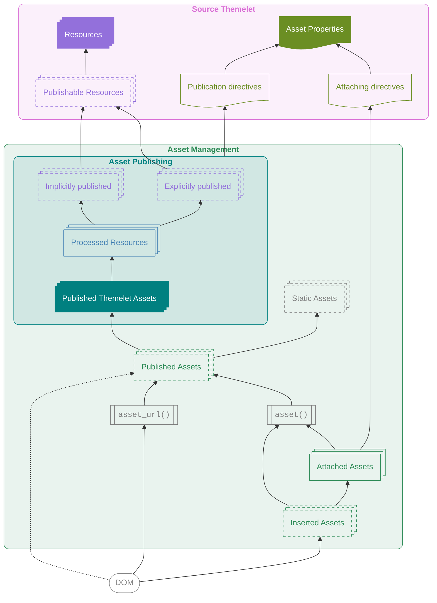

#  `MyBB\View` Architecture

_The View domain manages the graphical user interface, themes, layout resources and assets._

## Overview
To render pages for web browsers, MyBB's core and Plugins use _View_ — by calling the `Runtime` object and helper functions.

The web GUI is built using files (_Resources_) provided by active Themes and Plugins. Resources from each Extension's GUI package (_Themelet_) are included in an inheritance hierarchy queried to return metadata, publish Assets, and render HTML.


## Themelets
A **Themelet** contains files defining the visual appearance of the GUI.

The files are organized into **namespaces**, which style separate interfaces and contexts. Each namespace may contain:
- **Resources** — files used for server-side rendering, or for generating client-side Assets,
- **Resource Properties** (`resources.json`) — metadata files for contained Resources,
- **Asset Properties** (`assets.json`) — metadata files for generating and managing Assets.

Resources are organized by Type, and may be grouped in arbitrary directories, while metadata files are stored at the top level.

##### **Example: A Themelet Directory Tree**
```
frontend/
    images/
    scripts/
    styles/
    templates/

    assets.json
    resources.json
acp/
    ...
```

### View Extensions
Two types of Extensions provide Themelets (`ViewExtensionInterface`):
- A **Plugin** may supply a Themelet (in a `view/` subdirectory) to provide default styling for its interface.

  Plugins' Resources are placed in a dedicated namespace for the Plugin (`ext.`…), and can be overridden by Themes.

- A **Theme** has its own Themelet (in the same directory), and may style any namespace.

  Each Theme has an implicit type, according to its package name prefix:
  - **Board Theme** (`theme.`…) — a local package authored by administrators,
  - **Original Theme** — an Extension with assigned codename, authored by Theme creators,
  - **Core Theme** (`core.`…) — distributed with, and authored by MyBB.

### Inheritance
Themes, in addition to overriding Plugins' default styling, may inherit and override other Themes present in the installation (`HierarchicalExtensionInterface`).

A Theme's manifest file may include an `inherits` declaration, referencing one or more Themes. A Theme can inherit from Themes of the same or higher type (an _Original Theme_ may only inherit from another _Original Theme_ or a _Core Theme_). The Theme ancestry is built recursively.

The effective **inheritance chain** is defined in the following order, by decreasing priority:
  1. The reference Theme
  2. Ancestors of the reference Theme (from closest to furthest, ending with a Core Theme)
  3. Themelets of active Plugins

<br>

**Diagram: Themelet Inheritance Path**



<br>
<br>

Entities and Properties are inherited by default. Inheritance can be severed on a namespace and item basis in each Properties file.

The resulting resolved hierarchy is used as a virtual source for building and rendering the GUI.


## Entities
The metadata of _View_ entities — including inheritance declarations — is stored in the respective JSON files (`resources.json`, `assets.json`).

### Properties
The JSON files include shared properties (applied to all entities) at the top level, and entity-specific properties grouped under the corresponding key (`assets`, `resources`).
```json5
{
  // shared properties

  "<NAME>": {
    "<ENTITY-KEY>": {
      // entity properties
    },
  },
}
```

#### `inherits`
Shared, and entity-specific properties may include the `inherits` key, set to one of the following options:
- ##### `null`
  Default inheritance (`true`).

- ##### `true`
  Inherits from ancestors.

- ##### `false`
  Does not inherit from ancestors.

- ##### `{list<string>}`
  An array of ancestor Package names, from furthest to closest.

  For example:
  ```json
  "inherits": [
    "core.base",
    "downloaded_theme"
  ]
  ```

### Cargo
Entities use the repository pattern with logic provided by `Cargo` classes, which return properties and instances according to resolved inheritance.

Entities contained in namespaces use the specialized `NamespaceCargo` classes, which add Themelet-related logic.

##### **Diagram: Cargo Abstraction**



## Locators
References to Resources and Assets use _Locators_, saved as strings in configuration files and Resources.

**Themelet Locators** refer to entities within a Themelet structure, resolved according to the inheritance hierarchy, or for a specific Package.

Its components correspond to the directory structure within a Themelet, and include the namespace (prefixed with `@`), Resource Type, Resource group, and Resource name. Depending on the place of use, some components may be implied by context.

For example, Locators in Templates are resolved in relation to the containing Resource:
```twig
{# Full Themelet Locator #}


{# Type "template" implied when in templates context #}


{# same namespace implied #}


{# same group (directory) implied #}

```

<br>

**Static Locators** are non-interpreted references to local or remote files not managed by _View_.

A string is a Static Locator if it:
- starts with `/` (domain root),
- starts with `./` (MyBB root),
- starts with `../` (relative to visited directory), or
- contains `://`.

Locators referencing static files (e.g. in `jscripts/`) use the `./` format, and have the board/CDN URL prepended in the HTML output.

For example:
```twig
{{ asset('./jscripts/general.js') }}
{{ asset('../site.css') }}
{{ asset('/manifest.json') }}
{{ asset('https://example.com/logo.png') }}
```


## Templates
Themelets may include **Templates** — Resources processed server-side with [Twig](https://twig.symfony.com/).

Templates are rendered using the `template()` function, which accepts a Themelet Locator relative to the main namespace, and returns the resulting HTML.

The Locator is used to establish the filesystem path to the Template file, and passed to Twig (`ThemeletLoader`).

The Twig runtime renders the template using the configured options, Twig extensions, and variables; and cached.


## Assets
Returned HTML pages rely on **Assets** — additional files accessible to the web browser (e.g. styles, scripts, images). _View_ uses Themelet contents and Asset declarations to prepare and include them automatically.

### Asset Publishing
Themelet Resources are used to create local Assets. Assets may be published:
- explicitly — by declaring Assets and source Resource(s) in the Asset Properties file or function calls, or
- implicitly — by adding Resources of common web file types to the Themelet.

_View_ may **process** them to desired formats (e.g. SCSS to CSS), and **publish** them by placing the resulting files in a web-accessible directory.

### Asset Management
_View_ manages:
  - **attaching** of Assets and their dependencies to the DOM for specified requests,
  - **insertion** of Assets into the DOM with the necessary HTML tags.


Asset Management supports both Themelet Assets and non-system Assets (external URLs or hardcoded local paths).

Additionally, _legacy_ stylesheets (stored in the database and associated with the activated theme), which may be inserted by Plugins, are attached depending on the accompanying conditions.

#### Declarations
Asset Management features may be declared using:
- ##### **Asset Properties** (`assets.json`)
  The preferred method, as the data is always accessible. This allows MyBB to manage all aspects of the lifecycle — from all-at-once publishing to DOM inclusion with the correct HTML attributes.

- ##### **API functions**
  PHP and Twig Template functions used for dynamic declarations:
  - `asset()`, used to declare, insert, and render Assets for local HTML inclusion (`local: true`).
  - `asset_url()`, used to access the web-accessible Asset path.

<br>
The available Asset Management functionality depends on the declaration type.

##### **Table: Asset Declarations Types**
Declaration Type | ℹ Metadata | ℹ Content | 🚥 Path | 🚥 HTML | 🚥 Placement
-|-|-|-|-|-
Asset Properties | ✅ Yes | ✅ Yes | ✅ Yes | ✅ Yes | ✅ Yes
`asset()` | ⚠️ Dynamic | ✅ Yes | ✅ Yes | ✅ Yes | ✅ Yes
`asset(local: true)` | ⚠️ Dynamic | ✅ Yes | ✅ Yes | ✅ Yes | ❌ No
Hardcoded `asset_url()` | ❌ No | ✅ Yes | ✅ Yes | ❌ No | ❌ No
Hardcoded | ❌ No | ❌ No | ❌ No | ❌ No | ❌ No

The application has:
- _ℹ Awareness_:
  - **Metadata**: can access all metadata assigned to an Asset
  - **Content**: can query the Asset content (stored in a separate file)
- _🚥 Control_:
  - **HTML**: controls the HTML representing the Asset in the DOM
  - **Path**: controls the path referenced in the DOM
  - **Placement**: controls where in the DOM the Asset is inserted

<br>

##### **Diagram: Asset Publishing and Management**



## Runtime
The `Runtime` object accepts and manages context data — including the reference Theme (the global default, group/forum setting, or user preference) — and provides View-related features.

### Themelet Decoration
`Runtime` uses the Themelet from the reference Theme extended with the following functionality:

- #### Hierarchy
  `HierarchicalThemelet` provides **vertical resolution and merging** of entities and their properties.
  
  It accepts Plugin Themelets as as the inheritance base, and uses the Theme's defined inheritance.

  The Hierarchical Themelet functions as a single set of metadata and Resources for reading, and a dispatcher for write operations.

- #### Publishing
  `PublishableThemelet` provides **Asset publishing** information and features.

- #### Composition
  `CompositeThemelet` performs **horizontal resolution and merging** from active namespaces, reconciling references to the same Assets to render the page.


## Performance
MyBB performs all rendering operations server-side, beginning with hierarchical **resolution**, where individual items and their metadata is accessed according to declared inheritance. These sources are used for the **generation** of items for usage, most impactful during cache warm-up. The **execution** stage involves the execution of Twig Templates and may be further optimized through server configuration.

The table below highlights the practical performance impact (a product of individual computation cost, and usual number of iterations) of these operations.

##### **Table: Performance Impact of View Operations**
Stage | Data | Sources | Building Cost | Validation Target | Validation Cost
-|-|-|-|-|-
**Ancestry** | Source Themelets | Extension manifests | 🟢 Low | Extension manifest stamp | 🟢 Low
**Resolution** | Entity Properties | Property files | 🟢 Low | Ancestry; Property file stamps | 🟢 Low
**Resolution** | Entities | Property files, Entity files | 🟨 Medium | Ancestry; Property file stamps | 🟨 Medium
**Generation** | Assets | Resources | 🔺 High | Entity Properties; Resources | 🟨 Medium
**Generation** | Templates | Resources | 🔺 High | Resources | 🟨 Medium
**Execution** | Template opcode | Templates | 🟨 Medium | Twig cache; _Opcache-dependent_ | 🟨 Medium

### Cache Validation
Generated content is refreshed using metadata of entities depended upon (bottom-to-top). File modification times or checksums are used as _stamps_, validated according to the configured [`Optimization`](Optimization.php) level. Higher levels offer better performance.

With 🟩`BALANCED` or lower, the system detects high-level changes (i.e. in manifests or Property files), by resolving and generating affected Templates and Assets when necessary.

With 🟦`WATCH` or lower, changes in individual Resources are propagated automatically.


##### **Table: Optimization Mode Required to Propagate Changes**
&ZeroWidthSpace; | Extension ancestry change | Resource change | Resource Properties change | Asset Properties change
-|-|-|-|-
Re-generate **Template** | ≤ 🟩`BALANCED` | ≤ 🟦`WATCH` | ≤ 🟩`BALANCED` | n/a
Re-generate **Asset** | ≤ 🟩`BALANCED` | ≤ 🟦`WATCH` | ≤ 🟩`BALANCED` | ≤ 🟩`BALANCED`


## [ABNF](https://datatracker.ietf.org/doc/html/rfc5234)
```abnf
; Extensions
extension-codename = 1*( a-z / "_" )
package-version    = 1*( DIGIT / a-z / "." / "-" ) ; format supported by PHP's version-compare()

plugin-package-name    = extension-codename
theme-package-name     = extension-codename      ; distributed Theme
                       / "theme." 1*DIGIT        ; Board Theme
                       / "core." 1*( a-z / "_" ) ; Core Theme

plugins-directory-path    = "inc/plugins"
themes-directory-path     = "inc/themes"
extension-directory-path  = plugin-directory-path
                          / theme-directory-path

plugin-directory-path = plugins-directory-path "/" plugin-package-name
theme-directory-path  = themes-directory-path "/" theme-package-name

extension-manifest-file-path   = extension-directory-path "/manifest.json"

; Themelets
themelet-directory-path = plugin-directory-path "/view"
                        / theme-directory-path

; Resources
namespace = 1*( a-z / "_" )           ; Generic Namespace
          / "ext." extension-codename ; Extension Namespace

namespace-path = namespace "/"
               / "" ; direct (single-namespace Plugin Themelet)

resource-type = "images"
              / "scripts"
              / "styles"
              / "templates"

resource-group = 1*( a-z / "_" / "/" )
resource-filename = 1*VCHAR "." 1*VCHAR

resource-path = namespace-path resource-type "/" [resource-group "/"] resource-filename
absolute-resource-path = <web-root-directory> "/" themelet-directory-path "/" resource-path

resource-properties-file-path = themelet-directory-path "/" namespace "/resources.json"
asset-properties-file-path = themelet-directory-path "/" namespace "/assets.json"

; Locators
explicit-directory-path = ( "/" / "./" / "../" ) *VCHAR
remote-path = "//" *VCHAR
            / *VCHAR "://" *VCHAR
static-locator = explicit-directory-path / remote-path

themelet-locator = ["@" namespace "/"] [resource-type "/"] [resource-group "/"] resource-filename
```

---
## References
- **Design choices & plans:** https://github.com/mybb/meta/blob/main/architecture/mybb-1.9-theme-system.md
